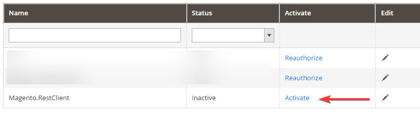
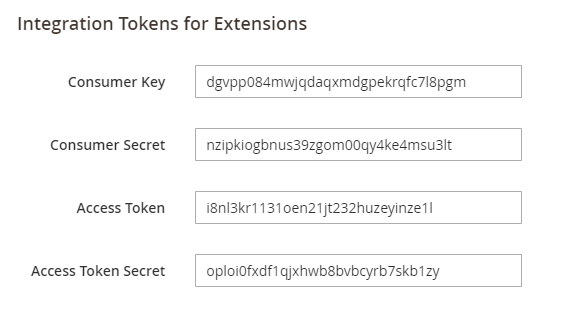

# Magento.RestClient

[TOC]

## Authentication

### Integration

To authenticate as Integration, go to System -> Extensions -> Integrations and add a new Integration. Just give it a name, other values are not required. Custom resource access is not explicitly supported, but might work. Your mileage may vary.

After that, all that remains is to activate the integration.



Take note of the tokens in the next step, as you'll be using them to connect.



After this, to connect you'll only need the following code:
```csharp
var consumerKey = "";
var consumerSecret = "";
var accessToken = "";
var accessTokenSecret = "";

var client = new MagentoClient("http://localhost/rest/V1/");
this.IntegrationClient = client.AuthenticateAsIntegration(consumerKey, consumerSecret, accessToken, accessTokenSecret);
```

## Search


## Products

### Configurable Products


